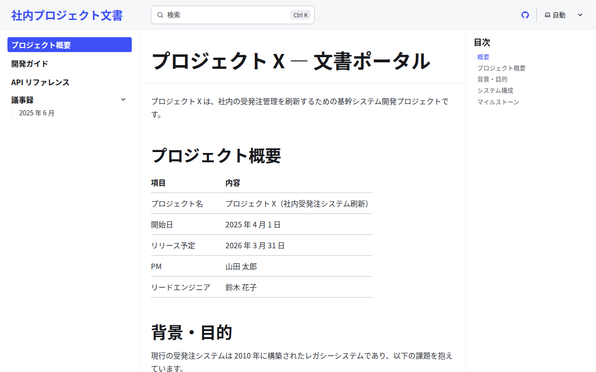

# Astro + Starlight サンプル

## スクリーンショット

| トップページ | 開発ガイド |
|---|---|
|  |  |

## 特徴

- **Astro** は「Islands Architecture」で **超軽量な静的サイト**を生成（デフォルトで JS ゼロ出力）
- **Starlight** は Astro 公式のドキュメント用テーマ。これ単体で本格的な文書サイトが完成する
- **全文検索（Pagefind）が標準内蔵**。設定不要で日本語検索も動く
- **ダークモード・i18n（多言語）・サイドバー自動生成**が最初から備わっている
- React / Vue / Svelte など好きな UI フレームワークのコンポーネントを混在できる
- ページ表示が非常に高速（Lighthouse スコアが出やすい）

## 向いている用途

- パフォーマンス重視の社内ポータル
- 設定を最小限に、見栄えの良い文書サイトをすぐ立てたい場合
- 将来 React/Vue などのインタラクティブ要素も足したい場合

## セットアップ

```bash
cd astro

# このディレクトリ専用の依存をインストール
npm install

# 開発サーバー（http://localhost:4321）
npm run dev

# 本番ビルド（dist/ に出力。検索インデックスもここで生成）
npm run build

# ビルド結果のプレビュー
npm run preview
```

## ディレクトリ構成

```
astro/
├── package.json            # npm 依存（このディレクトリ専用）
├── astro.config.mjs        # Astro + Starlight 設定（サイドバー等）
└── src/
    └── content/
        ├── config.ts       # コンテンツコレクション定義
        └── docs/
            ├── index.md
            ├── getting-started.md
            ├── api-reference.md
            └── meeting-notes/
                └── 2025-06.md
```

## 基本操作（SSG の作り方）

> 詳細は公式ドキュメント（[Astro](https://docs.astro.build/) / [Starlight](https://starlight.astro.build/ja/)）を参照。ここでは最低限必要な操作だけまとめます。

### 記事（ページ）を追加する

1. `src/content/docs/` 配下に Markdown（`.md` / `.mdx`）を置く
2. サイドバーは `astro.config.mjs` の `sidebar` 配列に追記（または `autogenerate` でフォルダから自動生成）

ファイル先頭の **Front Matter** に `title` が必須です。

```markdown
---
title: インストール手順
---

本文をここに書く。
```

```js
// astro.config.mjs（サイドバーに手動で追加する場合）
sidebar: [
  { label: "開発ガイド", link: "/getting-started/" },
  { label: "インストール", link: "/install/" },   // 追加
],
```

### 内部リンクを作る

ルートからの絶対パスで他ページを指定します（Starlight がリンク切れをビルド時に検証）。

```markdown
詳しくは [開発ガイド](/getting-started/) を参照。
```

### 画像・静的ファイルを管理する

- 最適化したい画像は `src/assets/` に置き、相対参照すると自動で最適化される
- 加工不要なファイルは `public/` に置く（`public/img/foo.png` → `/img/foo.png`）

```markdown

```

### ビルドとプレビュー

```bash
npm run dev       # http://localhost:4321 でライブプレビュー
npm run build     # dist/ に出力（検索インデックス Pagefind もここで生成）
npm run preview   # dist/ をローカルサーバーで確認
```

## 配布方法のメリット・デメリット

### A. Web サーバーなしで HTML を直接配布する（file:// やファイル共有）

| | |
|---|---|
| ✅ | デフォルトで JS ゼロの軽量な静的 HTML を出力するため、Web サーバーに置けば非常に高速 |
| ❌ | 出力は **絶対パス**（`/_astro/…`）前提で、`file://` のダブルクリックや配置先が未確定だと CSS・リンクが崩れる |
| ❌ | 全文検索（Pagefind）は JS でインデックスを `fetch` するため `file://` では動かない（`http://` 配信が前提） |
| ⚠️ | サブフォルダ配布なら `astro.config.mjs` の `base` を配置パスに合わせる必要がある |

### B. GitLab Pages と連携する

`astro.config.mjs` に `site` と `base` を設定します。

```js
// astro.config.mjs
export default defineConfig({
  site: "https://<group>.gitlab.io",
  base: "/<repo>/",   // プロジェクト配下に置く場合は必須
  integrations: [/* starlight(...) */],
});
```

```yaml
# .gitlab-ci.yml
pages:
  image: node:20
  script:
    - cd astro && npm ci && npm run build
    - mv dist ../public
  artifacts:
    paths:
      - public
  rules:
    - if: $CI_COMMIT_BRANCH == $CI_DEFAULT_BRANCH
```

| | |
|---|---|
| ✅ | Web サーバー配信なら Pagefind 検索・ダークモードがすべて動作する |
| ✅ | `base` を設定すればサブパス配信でもリンク・アセットが正しく解決される |
| ❌ | `site` / `base` の設定漏れでリンクが崩れやすい |
| ❌ | `npm ci` + ビルドで CI 時間がかかる（Hugo ほど速くはない） |

## 長所 / 短所

| | |
|---|---|
| ✅ | 全文検索（Pagefind）が設定不要で内蔵 |
| ✅ | ダークモード・i18n・サイドバーが標準装備 |
| ✅ | 出力が軽量・高速（デフォルト JS ゼロ） |
| ✅ | React/Vue/Svelte コンポーネントを混在可能 |
| ❌ | エコシステムが新しめ（Docusaurus ほど枯れていない） |
| ❌ | バージョン管理機能は標準では弱い（Docusaurus が有利） |
| ❌ | Node.js 環境が前提 |
