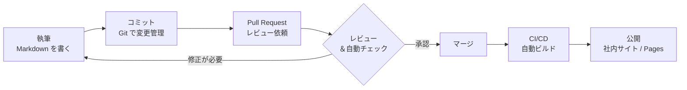

# Documentation as Code のワークフロー

このドキュメントは、**Documentation as Code（DaC）** の運用ワークフローを解説します。
「ドキュメントをコードと同じように扱う」とは具体的にどういう流れなのかを、
ライフサイクルと支える仕組みの両面から整理します。

> 概念の概要はルート [README.md](../../README.md) の「Documentation as Code とは」を参照してください。
> ここではより踏み込んで「**どう運用するか**」を扱います。

## DaC を支える 4 本柱

DaC は単一のツールではなく、次の 4 つの要素の組み合わせで成り立ちます。

| 柱 | 内容 | このリポジトリでの対応 |
|---|---|---|
| **1. テキストで書く** | Markdown / reStructuredText などプレーンテキストで執筆する | 各 SSG の `*.md` / `*.rst` |
| **2. Git で管理する** | 履歴・差分・ブランチで変更を追跡する | リポジトリ全体 |
| **3. レビューする** | Pull Request でコードと同じように品質を担保する | 後述のワークフロー |
| **4. 自動化する** | CI/CD でビルド・検査・公開を自動実行する | CI 設計（後述） |

どれか一つでも欠けると「ただ Markdown を書いているだけ」になり、DaC の効果は半減します。
**4 本柱が揃って初めて「コードと同じ開発体験」**になります。

## ライフサイクル

ドキュメントが「書かれてから公開されるまで」の流れは、ソフトウェア開発とほぼ同じです。

### 各ステップの詳細

1. **執筆（Write）**
   テキストエディタや IDE で Markdown を書きます。プレビューには各 SSG の
   `serve` / `dev` コマンド（例: `mkdocs serve`）を使い、ローカルで見た目を確認します。

2. **コミット（Commit）**
   変更を Git にコミットします。「いつ・誰が・なぜ」変更したかが履歴として残ります。
   フィーチャーブランチを切って作業するのが基本です。

3. **Pull Request（Propose）**
   変更をレビューしてもらうために PR を作成します。**差分（diff）が表示される**ため、
   どこをどう直したかが一目でわかります。

4. **レビュー & 自動チェック（Review）**
   - **人によるレビュー** — 内容の正確さ・わかりやすさを確認
   - **自動チェック（CI）** — ビルドが通るか、リンク切れがないか、表記ゆれがないか
   問題があれば 1 に戻って修正します。

5. **マージ（Merge）**
   承認されたら main ブランチに統合します。ここが「**正**」となる Single Source of Truth です。

6. **ビルド & 公開（Build & Publish）**
   マージをトリガーに CI/CD が SSG でサイトをビルドし、社内ネットワークや
   GitHub Pages（private）へ自動デプロイします。

## レビューの観点

コードレビューと同様に、ドキュメントにもレビュー基準を設けると品質が安定します。

- **正確性** — 記述が事実・最新の仕様と一致しているか
- **わかりやすさ** — 読み手（対象読者）に伝わる構成・表現か
- **一貫性** — 用語・表記・トーンが他のドキュメントと揃っているか
- **構造** — 見出し階層・リンク・目次が適切か
- **保守性** — 後から更新しやすいか（重複記述を避けているか）

## 自動化（CI/CD）で何を行うか

DaC の「自動化」の柱では、典型的に次のチェック・処理を CI に組み込みます。

| 種類 | 目的 | 代表的なツール |
|---|---|---|
| **ビルド検証** | SSG が正常にビルドできるか（壊れた記法の検出） | 各 SSG の build コマンド |
| **リンク切れチェック** | 内部・外部リンクが生きているか | lychee / markdown-link-check |
| **Markdown Lint** | 記法・スタイルの統一 | markdownlint |
| **文章校正** | 日本語の表記ゆれ・用語統一 | textlint / Vale |
| **自動デプロイ** | マージ後に本番サイトへ公開 | GitHub Actions など |

> このリポジトリには現状 CI 設定（`.github/workflows/`）は含まれていません。
> 学習を進める際は、まず「PR で各 SSG をビルドする」ワークフローから追加すると、
> DaC の自動化を実際に体験できます。

## 従来のドキュメント管理との比較

| 観点 | 従来（Word / Wiki / 共有ドライブ） | Documentation as Code |
|---|---|---|
| **変更履歴** | 追いにくい / 上書きで消える | Git で完全に追跡 |
| **レビュー** | メールや口頭で属人的 | Pull Request で標準化 |
| **差分表示** | 困難 | 行単位の diff |
| **コードとの整合** | 別管理で乖離しやすい | 同じリポジトリで同期 |
| **再利用・自動生成** | 手作業 | テンプレート / 自動生成 |
| **学習コスト** | 低い | Git / SSG の習得が必要 |
| **WYSIWYG 編集** | 得意 | テキスト中心（プレビューで補う） |

DaC は万能ではなく、**Git や Markdown の学習コストがかかる**というトレードオフがあります。
「変更追跡・レビュー・自動化の価値が学習コストを上回るか」が導入判断のポイントです。

## 次に読む

書いた個々のドキュメントを、全社で束ねて発見しやすくする仕組みについては
[Developer Portal / IDP 解説](./developer-portal.md) を参照してください。
