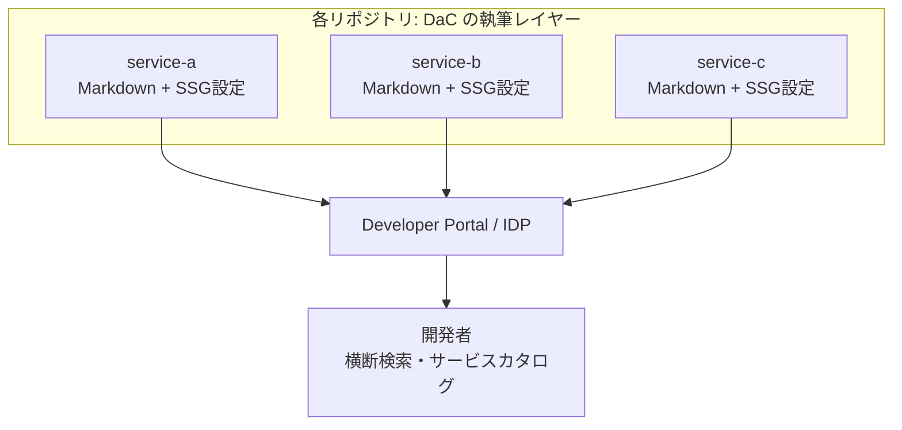

# Developer Portal / IDP — ドキュメントを束ねる基盤

このドキュメントは、DaC で書いた個々のドキュメントを **全社・組織横断で集約し、
発見しやすくする** ための基盤である **Developer Portal（IDP）** について解説します。

> 前提として [DaC ワークフロー解説](./dac-workflow.md) を読んでおくと、
> 本ドキュメントの位置づけがわかりやすくなります。

## なぜポータルが必要か

SSG で DaC を実践すると、ドキュメントは**各リポジトリに分散**します。
リポジトリが数個なら問題ありませんが、組織が大きくなると次の課題が出てきます。

- どこにどのドキュメントがあるか**探せない**
- サービスと、その**ドキュメント・オーナー・依存関係が結びつかない**
- SSG ごとに見た目・検索がバラバラで**一覧性がない**

これらを解決するのが **Developer Portal** です。DaC が「個々の文書を書く層」だとすれば、
ポータルは「**書かれた文書を組織全体で束ねて届ける層**」にあたります。



## IDP とは

**IDP（Internal Developer Portal、内部開発者ポータル）** は、開発者が必要とする
情報・ツール・ドキュメントを**一つの入口**に集約する仕組みです。主な機能は次のとおりです。

- **サービスカタログ** — 社内のサービス・コンポーネント・オーナーの一覧
- **ドキュメント集約（TechDocs 等）** — 各リポジトリの DaC ドキュメントを統合表示
- **横断検索** — 組織全体のドキュメントを一括で検索
- **テンプレート（Scaffolder）** — 新規サービス・ドキュメントの雛形生成
- **プラグイン** — CI/CD、監視、クラウドなど各種ツールとの統合

> 「Internal Developer **Portal**（IDP）」と「Internal Developer **Platform**（IdP）」は
> 近い概念ですが、前者は「入口・UI」、後者は「基盤・自動化の仕組み」を指すことが多いです。
> ここでは主に **ポータル（Portal）** の意味で扱います。

## Backstage と TechDocs

DaC との関係で特に重要なのが **[Backstage](https://backstage.io/)** です。

- Spotify が開発し、現在は **CNCF** のプロジェクトとして OSS で公開されている IDP
- その中の **TechDocs** が Docs-as-Code 機能を担う

### TechDocs のしくみ

TechDocs の中身は **MkDocs（＋Material for MkDocs）** です。
つまりこのリポジトリの [`mkdocs/`](../../mkdocs/) サンプルと**ほぼ同じ書き方**で執筆できます。

```
[各リポジトリ]
  docs/*.md + mkdocs.yml   ← MkDocs と同じ記法で執筆（= DaC の執筆レイヤー）
        │
        ▼  Backstage / TechDocs がビルド
[Backstage ポータル]
  サービスカタログと統合して集中表示・横断検索
```

ポイントは、**執筆者は普段どおり Markdown を書くだけ**で、それが自動的に
組織のポータルに集約される点です。DaC の自然な発展形と言えます。

## 主な選択肢

| 種類 | プロダクト | 特徴 |
|---|---|---|
| **OSS の IDP** | **Backstage** | 自前ホスティング、プラグインで拡張、TechDocs は MkDocs ベース |
| **マネージド IDP** | Port / Cortex / OpsLevel | SaaS、構築不要で導入が速い |
| **ドキュメント特化ホスティング** | Read the Docs | Sphinx / MkDocs のホスティングに特化、ポータル寄り |

## このリポジトリとの関係・位置づけ

Backstage / IDP は **SSG ではなくポータル基盤**であり、役割が異なります。
そのため、ルート README の「比較対象」表には含めていません。

| レイヤー | 役割 | このリポジトリの扱い |
|---|---|---|
| **執筆（SSG）** | Markdown から HTML/PDF を生成 | **比較対象**（mkdocs/ ほか） |
| **集約（IDP/Portal）** | 組織のドキュメントを束ねる | **概念として紹介**（本ドキュメント） |

学習の到達点として、「個々のドキュメントを DaC（SSG）で書く → それを Backstage の
ような IDP で全社に届ける」という**階層構造**を理解しておくと、
ツール選定や将来の運用設計の見通しが立てやすくなります。

## 参考リンク

- [Backstage 公式サイト](https://backstage.io/)
- [Backstage TechDocs ドキュメント](https://backstage.io/docs/features/techdocs/)
- [Read the Docs](https://about.readthedocs.com/)
