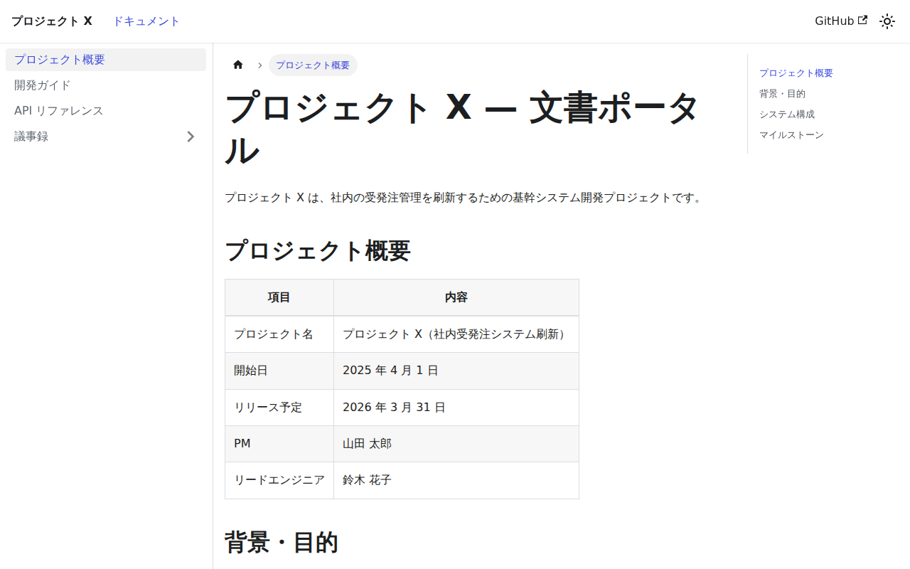
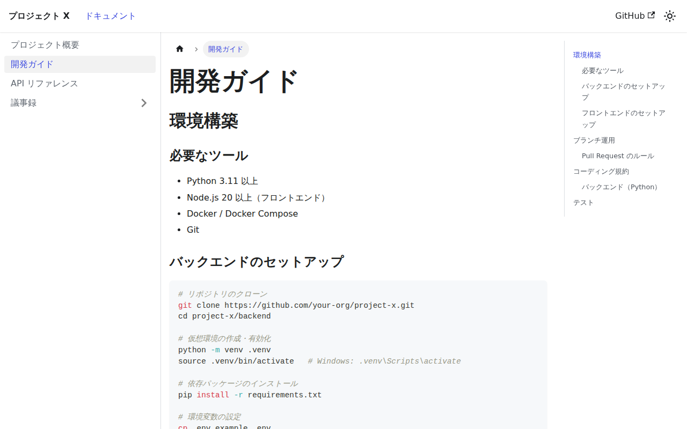

# Docusaurus サンプル

## スクリーンショット

| トップページ | 開発ガイド |
|---|---|
|  |  |

## 特徴

- **Facebook（Meta）製**の React ベースドキュメントサイトジェネレータ
- **バージョン管理**が組み込み（v1/v2/v3 を並存できる）
- **全文検索**（Algolia DocSearch または `@easyops-cn/docusaurus-search-local`）
- MDX（Markdown + JSX）でリッチなコンポーネントを埋め込める
- サイドバー・ナビゲーションの設定が柔軟

## 向いている用途

- 複数バージョンを持つプロジェクトの仕様書
- 検索機能を重視する社内ポータル
- React チームが文書も管理したい場合

## セットアップ

```bash
cd docusaurus
npm install
npm run start       # http://localhost:3000 でプレビュー
npm run build       # build/ にビルド成果物が出力される
npm run serve       # ビルド後の確認用サーバー
```

### ローカル検索の有効化

```js
// docusaurus.config.js の themeConfig に追加
plugins: [
  [
    "@easyops-cn/docusaurus-search-local",
    {
      hashed: true,
      language: ["ja"],
    },
  ],
],
```

## ディレクトリ構成

```
docusaurus/
├── docusaurus.config.js    # 設定ファイル
├── sidebars.js             # サイドバー構成
├── package.json
└── docs/
    ├── index.md
    ├── getting-started.md
    ├── api-reference.md
    └── meeting-notes/
        └── 2025-06.md
```

## 長所 / 短所

| | |
|---|---|
| ✅ | バージョン管理が標準搭載 |
| ✅ | MDX で React コンポーネントを埋め込める |
| ✅ | 全文検索・タグ・ブログも対応 |
| ❌ | Node.js / React の知識が前提 |
| ❌ | 初回 `npm install` が重い（依存が多い） |
| ❌ | ビルド速度は MkDocs / Hugo より遅い |
