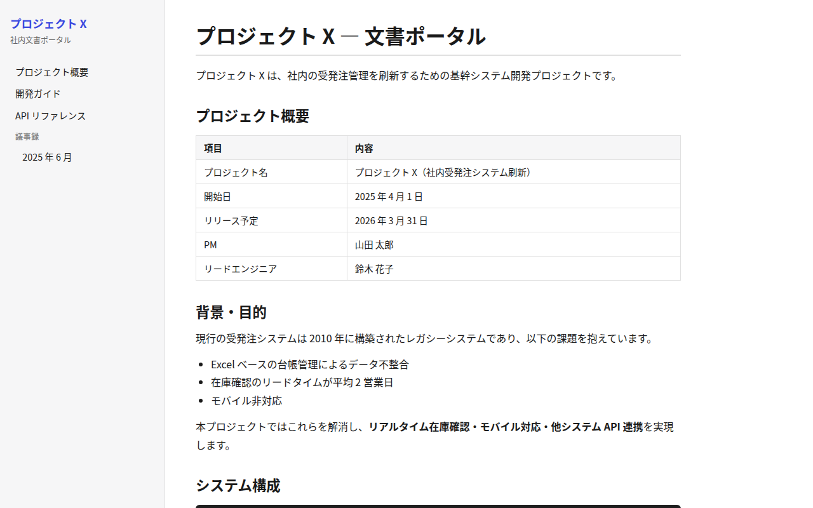

# Eleventy（11ty）サンプル

## スクリーンショット

| トップページ | 開発ガイド |
|---|---|
|  |  |

## 特徴

- **JavaScript** 製で設定の自由度が最大
- テンプレートエンジンを自由に選択（Nunjucks・Liquid・EJS・Pug など）
- 依存ライブラリが最小限で動作が軽量
- ページのデータカスケード（`_data/` ）が柔軟
- 意見（opinionated な構成）が少ない

## 向いている用途

- 独自デザインの社内ポータル
- フロントエンドエンジニアがゼロから設計したい場合
- 特殊なデータソース（社内 API・JSON）から文書を生成したい場合

## セットアップ

```bash
cd eleventy
npm install
npm run serve       # http://localhost:8080 でプレビュー
npm run build       # _site/ にビルド成果物が出力される
```

## ディレクトリ構成

```
eleventy/
├── .eleventy.js            # 設定ファイル（JavaScript）
├── package.json
└── src/
    ├── _layouts/
    │   └── base.njk        # ベースレイアウト（Nunjucks）
    ├── css/
    │   └── style.css       # スタイルシート
    ├── index.md            # トップページ
    └── docs/
        ├── getting-started.md
        ├── api-reference.md
        └── meeting-notes/
            └── 2025-06.md
```

## 基本操作（SSG の作り方）

> 詳細は公式ドキュメント（[Eleventy](https://www.11ty.dev/docs/)）を参照。ここでは最低限必要な操作だけまとめます。

### 記事（ページ）を追加する

`src/` 配下に Markdown を置きます。Front Matter で使うレイアウトやメタデータを指定します。

```markdown
---
layout: base.njk     # src/_layouts/base.njk を使う
title: インストール手順
order: 5             # 一覧の並び順（.eleventy.js の collection で使用）
---

本文をここに書く。
```

- 出力 URL は `src/docs/install.md` → `/docs/install/` のようにフォルダ構成から決まる
- `permalink` を Front Matter に書けば出力先を任意に変更できる

### 内部リンクを作る

Eleventy は標準ではリンクを補助しないため、リンクは自分で書きます。

```markdown
詳しくは [開発ガイド](/docs/getting-started/) を参照。
```

> 移動・改名に強くしたいなら、リンク切れ検出プラグイン等を別途導入します（標準では自前管理）。

### 画像・静的ファイルを管理する

`.eleventy.js` の `addPassthroughCopy` で指定したフォルダがそのまま出力にコピーされます（本サンプルでは `src/css` と `src/img` を設定済み）。

```js
// .eleventy.js
eleventyConfig.addPassthroughCopy("src/img");
```

```markdown

```

### ビルドとプレビュー

```bash
npm run serve     # http://localhost:8080 でライブプレビュー
npm run build     # _site/ に静的 HTML を出力
```

## 配布方法のメリット・デメリット

### A. Web サーバーなしで HTML を直接配布する（file:// やファイル共有）

| | |
|---|---|
| ✅ | テンプレートを自由に組めるため、**完全に相対パスだけの構成**にして `file://` で開ける静的サイトを作りやすい |
| ✅ | 余計な JS を含めないので、オフライン配布でも壊れる要素が少ない |
| ❌ | 本サンプルは絶対パス（`/css/style.css` 等）を使っているため、そのままでは `file://` で CSS が崩れる。下記の対応が必要 |
| ❌ | 検索などの機能は標準にないため、オフライン用途では自前で用意する |

`file://` 配布やサブパス配置に対応するには、`pathPrefix` を設定し、テンプレートのリンクを相対化（`url` フィルタ等）します。

```bash
# サブパス配下に出す例
npx @11ty/eleventy --pathprefix=/<repo>/
```

### B. GitLab Pages と連携する

```yaml
# .gitlab-ci.yml
pages:
  image: node:20
  script:
    - cd eleventy && npm ci
    - npx @11ty/eleventy --pathprefix=/$CI_PROJECT_NAME/ --output=../public
  artifacts:
    paths:
      - public
  rules:
    - if: $CI_COMMIT_BRANCH == $CI_DEFAULT_BRANCH
```

| | |
|---|---|
| ✅ | 依存が少なくビルドが軽量・高速 |
| ✅ | `pathPrefix` でサブパス配信に対応できる（テンプレートで `url` フィルタを使うのが前提） |
| ❌ | リンクの相対化やアセット配置は自分で設計する必要がある（自由＝自己責任） |
| ❌ | 検索・ナビなどは標準にないため、Pages 上でも機能追加は自前 |

## 長所 / 短所

| | |
|---|---|
| ✅ | 設計の自由度が最大（テンプレート・データソースなど） |
| ✅ | 依存が少なく軽量 |
| ✅ | 既存の HTML / CSS をそのまま使える |
| ❌ | 「標準の正解」がないので設計力が問われる |
| ❌ | プラグインエコシステムは MkDocs / Docusaurus より小さい |
| ❌ | 検索などは自前実装または外部サービスが必要 |
