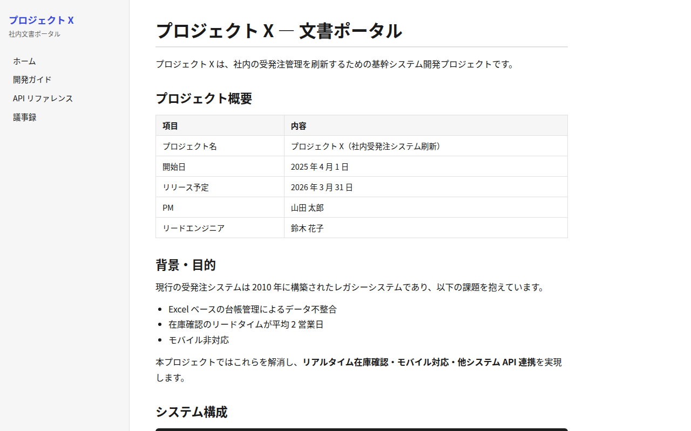

# Hugo サンプル

## スクリーンショット

| トップページ | 開発ガイド |
|---|---|
|  |  |

## 特徴

- **Go** 製のバイナリ 1 つで動作。インストールが超簡単
- **ビルド速度が圧倒的に速い**（数千ページでも数秒）
- テーマが豊富（Docsy・Hugo Book・PaperMod など）
- Front Matter（TOML / YAML）で柔軟なメタデータ管理
- Git で管理しやすいシンプルな構成

## 向いている用途

- ページ数が多い大規模社内 Wiki
- ビルドを CI/CD に組み込んで自動デプロイしたい場合
- Go チームの社内文書

## セットアップ

```bash
# Hugo のインストール（macOS）
brew install hugo

# Linux / Windows → https://gohugo.io/installation/

cd hugo
hugo server         # http://localhost:1313 でプレビュー
hugo                # public/ にビルド成果物が出力される
```

> **注**: このサンプルはテーマなしの最小構成です。実際の利用では `themes/` に Docsy などを追加してください。

## ディレクトリ構成

```
hugo/
├── hugo.toml           # 設定ファイル
└── content/
    ├── _index.md       # トップページ
    └── docs/
        ├── getting-started.md
        ├── api-reference.md
        └── meeting-notes/
            └── 2025-06.md
```

## 基本操作（SSG の作り方）

> 詳細は公式ドキュメント（[Hugo](https://gohugo.io/documentation/)）を参照。ここでは最低限必要な操作だけまとめます。

### 記事（ページ）を追加する

`content/` 配下に Markdown を置きます。`hugo new` を使うとアーキタイプから雛形を生成できます。

```bash
hugo new docs/install.md     # content/docs/install.md を生成
```

各ファイル先頭の **Front Matter**（メタデータ）でタイトルや並び順を指定します。

```markdown
---
title: "インストール手順"
weight: 5          # メニュー・一覧での並び順
draft: false       # true の間はビルドされない
---

本文をここに書く。
```

### 内部リンクを作る

リンク切れをビルド時に検出できる `ref` / `relref` ショートコードを推奨します。

```markdown
詳しくは  を参照。

通常の相対リンクも可: [開発ガイド](/docs/getting-started/)
```

### 画像・静的ファイルを管理する

- グローバルな静的ファイルは `static/` に置く（`static/img/foo.png` → `/img/foo.png` で参照）
- 記事に紐づく画像は **ページバンドル**（記事と同じフォルダ）に置ける

```
static/
└── img/
    └── architecture.png
```

```markdown

```

### ビルドとプレビュー

```bash
hugo server      # http://localhost:1313 でライブプレビュー（下書きは -D で表示）
hugo             # public/ に静的 HTML を出力
```

## 配布方法のメリット・デメリット

### A. Web サーバーなしで HTML を直接配布する（file:// やファイル共有）

| | |
|---|---|
| ✅ | テーマや動的機能に依存しない純粋な静的 HTML を出力でき、軽量で配りやすい |
| ❌ | **デフォルトの出力は絶対パス**（`/css/style.css` など）なので、`file://` やサブフォルダ配置ではリンク・CSS が崩れる |
| ❌ | 検索など JS 機能を入れた場合は `file://` で制限される |

`file://` 配布や配置先が未確定なら、相対パス出力に切り替えます。

```toml
# hugo.toml
relativeURLs = true
canonifyURLs = false
# もしくはビルド時に配置先を baseURL で固定する:
#   hugo --baseURL "./" --relativeURLs
```

### B. GitLab Pages と連携する

```yaml
# .gitlab-ci.yml
pages:
  image: registry.gitlab.com/pages/hugo/hugo_extended:latest
  script:
    - hugo --minify --baseURL "https://$CI_PROJECT_NAMESPACE.gitlab.io/$CI_PROJECT_NAME/" -d public
  artifacts:
    paths:
      - public
  rules:
    - if: $CI_COMMIT_BRANCH == $CI_DEFAULT_BRANCH
```

| | |
|---|---|
| ✅ | 公式の Hugo イメージがあり、ビルドが数秒で終わる（大規模でも高速） |
| ✅ | `--baseURL` をビルド時に渡すだけでサブパス配信に対応できる |
| ❌ | `baseURL` の指定を誤るとリンク・CSS が崩れるため、プロジェクト配下の URL を正しく渡す必要がある |
| ❌ | テーマが extended 版（SCSS）を要求する場合は `hugo_extended` イメージを使う必要がある |

## 長所 / 短所

| | |
|---|---|
| ✅ | ビルドが最速（大規模サイトに強い） |
| ✅ | バイナリ 1 つで動く（npm / pip 不要） |
| ✅ | テーマエコシステムが充実 |
| ❌ | Go テンプレート構文の学習コストがある |
| ❌ | テーマのカスタマイズは複雑になりがち |
