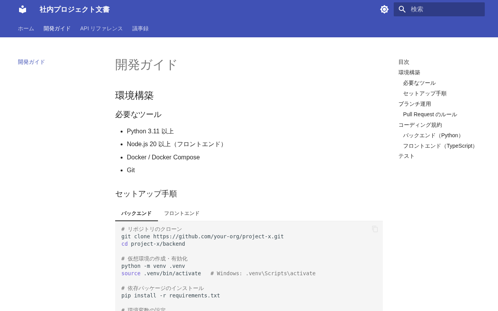

# MkDocs サンプル

## スクリーンショット

| トップページ | 開発ガイド |
|---|---|
|  |  |

## 特徴

- **Python** で動作。`pip` だけで導入できる
- **Material テーマ** が強力でそのままでも十分きれい
- タブ・Admonition（注釈ボックス）・コードコピーなど社内文書向け機能が充実
- `mkdocs.yml` 1 ファイルで設定が完結
- 日本語全文検索が標準で使える

## 向いている用途

- 技術文書・API リファレンス
- Python チームの社内 Wiki
- 小〜中規模のドキュメントサイト

## セットアップ

Python 製のため、**venv 仮想環境の利用を推奨**します。システムの Python を
汚さず依存を分離できます。仮想環境は **この `mkdocs/` ディレクトリ直下の
`.venv/`** に作成する前提です（`.venv/` は `.gitignore` 済み）。

```bash
cd mkdocs

# 仮想環境を作成・有効化（mkdocs/.venv に作成）
python -m venv .venv
source .venv/bin/activate     # Windows: .venv\Scripts\activate

# このディレクトリ専用の依存をインストール
pip install -r requirements.txt

mkdocs serve        # http://localhost:8000 でプレビュー
mkdocs build        # site/ にビルド成果物が出力される

deactivate          # 仮想環境を抜ける（任意）
```

## ディレクトリ構成

```
mkdocs/
├── mkdocs.yml          # 設定ファイル（ナビ・テーマ・プラグイン）
└── docs/
    ├── index.md
    ├── getting-started.md
    ├── api-reference.md
    └── meeting-notes/
        └── 2025-06.md
```

## 長所 / 短所

| | |
|---|---|
| ✅ | セットアップが最も簡単（pip install だけ） |
| ✅ | Material テーマが充実（ダークモード・検索・コードコピー） |
| ✅ | Admonition で注釈ボックスが書きやすい |
| ❌ | JavaScript/React に慣れたチームには学習コストあり |
| ❌ | バージョン管理は mike プラグインが別途必要 |
| ⚠️ | 本体・Material テーマとも更新が停滞中（下記「参考情報」を参照） |

## 参考情報 — MkDocs 本体の開発状況と後継プロジェクト

> 採用判断の参考として、MkDocs エコシステムの現状をまとめています
> （2026 年 6 月時点の調査）。社内文書のサンプルとして使う分には現行版で十分
> 動作しますが、**長期運用・新規大規模採用を検討する場合は後継プロジェクトの
> 動向も確認することを推奨します。**

### MkDocs 本体（`mkdocs/mkdocs`）の更新は実質停止

- 最新の安定版は **1.6.1（2024 年 8 月リリース）** で、以降 1 年以上にわたり
  実質的な機能開発が止まっています。
- オリジナル作者が MkDocs v2 の再設計に取り組んでいるとされますが、主に
  プライベートリポジトリでの作業で、本体の公開リポジトリは小さな修正を除き
  メンテナンスがほぼ行われていない状態です。

### Material for MkDocs もメンテナンスモードへ

- 本サンプルで採用している人気テーマ **Material for MkDocs** は、2025 年 11 月に
  **「メンテナンスモード」** への移行を公表しました。
- 重要なバグ修正・セキュリティ更新は（少なくとも 2026 年 11 月まで）継続されますが、
  **新機能の追加は行われません。**

### 後継として開発中のプロジェクト

| プロジェクト | 概要 |
|---|---|
| **Zensical**（本命） | Material for MkDocs チーム（squidfunk ら）による次世代 SSG。MIT ライセンス。Rust 製の差分ビルドエンジンを採用し、`mkdocs.yml` をネイティブに読めるため既存プロジェクトを最小限の変更で移行可能。反復ビルドが 4〜5 倍高速。**現状はアルファ段階で機能パリティは未達**だが、最も注目度が高い。 |
| ProperDocs | MkDocs 1.x 互換を維持するコミュニティ主導のフォーク。既存エコシステムとの互換性を重視。 |
| MaterialX | Material for MkDocs の継続を目指すコミュニティ版（mkdocs-material 後継）。 |

> **要点** — 「MkDocs 公式（本体・Material テーマ）は更新が止まりつつあり、
> 本流の後継は Material for MkDocs チームが開発中の Zensical」という状況です。
> Zensical は `mkdocs.yml` を流用できる設計のため、本サンプルの資産は将来的に
> 比較的低コストで移行できる見込みです。

参考リンク：
- [Zensical 公式発表（Material for MkDocs ブログ）](https://squidfunk.github.io/mkdocs-material/blog/2025/11/05/zensical/)
- [The Slow Collapse of MkDocs（Florian Maas）](https://fpgmaas.com/blog/collapse-of-mkdocs/)
- [MkDocs リポジトリ Discussion: Status of the project](https://github.com/mkdocs/mkdocs/discussions/3145)
