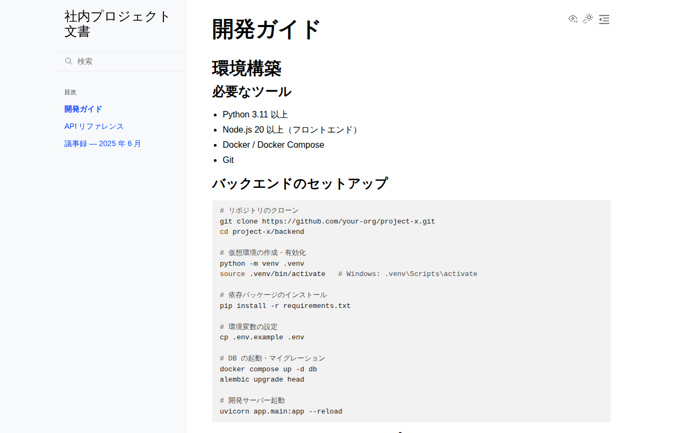

# Sphinx サンプル

## スクリーンショット

| トップページ | 開発ガイド |
|---|---|
|  |  |

## 特徴

- **Python 製**。Python 公式ドキュメントや多くの OSS で採用される定番ツール
- **reStructuredText (.rst)** が本来のフォーマット。MyST 拡張で **Markdown (.md)** も書ける（本サンプルは Markdown 採用）
- **強力な相互参照**：`:ref:` / `:doc:` でページや見出しを ID 参照でき、リンク切れをビルド時に検出
- **autodoc**：Python の docstring から API ドキュメントを自動生成できる
- **intersphinx**：他プロジェクトのドキュメント（Python 公式など）を相互参照できる
- **多彩な出力形式**：HTML だけでなく PDF（LaTeX）・ePub・man ページも生成可能

## 向いている用途

- Python ライブラリ・社内モジュールの API ドキュメント（docstring 自動生成）
- 厳密な相互参照・用語集が必要な大規模仕様書
- PDF 納品が必要な文書

## セットアップ

Python 製のため、**venv 仮想環境の利用を推奨**します。システムの Python を
汚さず依存を分離できます。仮想環境は **この `sphinx/` ディレクトリ直下の
`.venv/`** に作成する前提です（`.venv/` は `.gitignore` 済み）。

```bash
cd sphinx

# 仮想環境を作成・有効化（sphinx/.venv に作成）
python -m venv .venv
source .venv/bin/activate     # Windows: .venv\Scripts\activate

# このディレクトリ専用の依存をインストール
pip install -r requirements.txt

# HTML ビルド（build/html に出力）
sphinx-build -b html source build/html

# ライブリロード付きプレビュー（要 sphinx-autobuild）
# pip install sphinx-autobuild
# sphinx-autobuild source build/html
```

ビルド後 `build/html/index.html` をブラウザで開きます。

## ディレクトリ構成

```
sphinx/
├── requirements.txt        # Python 依存（このディレクトリ専用）
├── README.md
└── source/
    ├── conf.py             # 設定ファイル（Python）
    ├── index.md            # トップ + toctree（目次ツリー）
    ├── getting-started.md
    ├── api-reference.md
    └── meeting-notes/
        └── 2025-06.md
```

## 長所 / 短所

| | |
|---|---|
| ✅ | docstring からの API 自動生成（autodoc）が強力 |
| ✅ | 相互参照・リンク切れ検出が厳密 |
| ✅ | PDF / ePub など多彩な出力形式 |
| ✅ | MyST で Markdown も書ける |
| ❌ | reStructuredText の学習コストが高め |
| ❌ | 設定（conf.py）がやや複雑 |
| ❌ | デザインのモダンさは Material / Docusaurus に一歩譲る |
