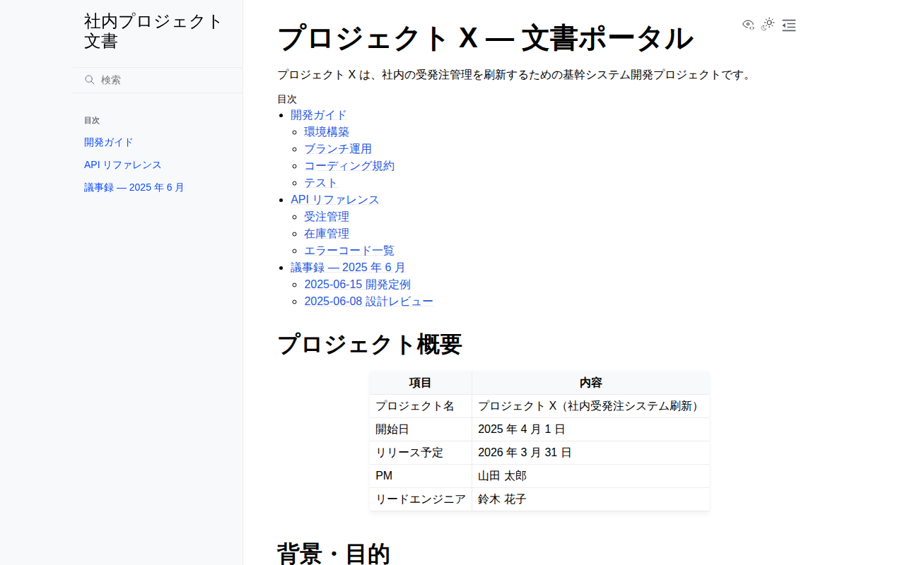

# Sphinx サンプル

## スクリーンショット

| トップページ | 開発ガイド |
|---|---|
|  |  |

## 特徴

- **Python 製**。Python 公式ドキュメントや多くの OSS で採用される定番ツール
- **reStructuredText (.rst)** が本来のフォーマット。MyST 拡張で **Markdown (.md)** も書ける（本サンプルは Markdown 採用）
- **強力な相互参照**：`:ref:` / `:doc:` でページや見出しを ID 参照でき、リンク切れをビルド時に検出
- **autodoc**：Python の docstring から API ドキュメントを自動生成できる
- **intersphinx**：他プロジェクトのドキュメント（Python 公式など）を相互参照できる
- **多彩な出力形式**：HTML だけでなく PDF（LaTeX）・ePub・man ページも生成可能

## 向いている用途

- Python ライブラリ・社内モジュールの API ドキュメント（docstring 自動生成）
- 厳密な相互参照・用語集が必要な大規模仕様書
- PDF 納品が必要な文書

## セットアップ

```bash
cd sphinx

# 仮想環境（任意）
python -m venv .venv
source .venv/bin/activate

# このディレクトリ専用の依存をインストール
pip install -r requirements.txt

# HTML ビルド（build/html に出力）
sphinx-build -b html source build/html

# ライブリロード付きプレビュー（要 sphinx-autobuild）
# pip install sphinx-autobuild
# sphinx-autobuild source build/html
```

ビルド後 `build/html/index.html` をブラウザで開きます。

## ディレクトリ構成

```
sphinx/
├── requirements.txt        # Python 依存（このディレクトリ専用）
├── README.md
└── source/
    ├── conf.py             # 設定ファイル（Python）
    ├── index.md            # トップ + toctree（目次ツリー）
    ├── getting-started.md
    ├── api-reference.md
    └── meeting-notes/
        └── 2025-06.md
```

## 基本操作（SSG の作り方）

> 詳細は公式ドキュメント（[Sphinx](https://www.sphinx-doc.org/) / Markdown 記法は [MyST](https://myst-parser.readthedocs.io/)）を参照。ここでは最低限必要な操作だけまとめます。

### 記事（ページ）を追加する

1. `source/` 配下に Markdown（`.md`）または reStructuredText（`.rst`）を置く
2. `source/index.md` の `toctree`（目次ツリー）にファイル名を追記する

````markdown
```{toctree}
:maxdepth: 2

getting-started
api-reference
guide/install        # 追加（拡張子は不要）
```
````

- `toctree` に載せたページがサイドバー・目次に並ぶ
- リンク切れ（存在しないページ参照）はビルド時に警告として検出される

### 内部リンク・相互参照を作る

Markdown の相対リンクのほか、Sphinx の **相互参照** が使えます（リンク先が移動・改名しても壊れにくい）。

```markdown
通常の Markdown リンク: [開発ガイド](getting-started.md)

ページ参照（MyST）: {doc}`開発ガイド <getting-started>`
見出し参照（ラベル）: {ref}`環境構築 <setup-label>`
```

### 画像・静的ファイルを管理する

画像は `source/_static/`（または任意のサブフォルダ）に置き、相対パスで参照します。

```
source/
├── index.md
└── _static/
    └── architecture.png
```

```markdown

```

### ビルドとプレビュー

```bash
sphinx-build -b html source build/html       # HTML（build/html/）
sphinx-build -b latexpdf source build/pdf    # PDF（要 LaTeX）
sphinx-build -b epub source build/epub       # ePub

# ライブリロード（pip install sphinx-autobuild）
sphinx-autobuild source build/html
```

## 配布方法のメリット・デメリット

### A. Web サーバーなしで HTML を直接配布する（file:// やファイル共有）

`build/html/` をそのまま配る使い方です。

| | |
|---|---|
| ✅ | 出力は CSS・リンクともに相対パス（`_static/…`, `getting-started.html`）なので、`index.html` をダブルクリックするだけで閲覧できる **最もオフライン配布に向いた SSG** |
| ✅ | HTML だけでなく **PDF / ePub** を生成でき、単一ファイルでの配布も選べる |
| ❌ | 全文検索（`searchindex.js`）は JavaScript の `fetch` を使うため、`file://` ではブラウザによって動かないことがある |

### B. GitLab Pages と連携する

```yaml
# .gitlab-ci.yml
pages:
  image: python:3.12
  script:
    - pip install -r sphinx/requirements.txt
    - sphinx-build -b html sphinx/source public   # public/ に出力
  artifacts:
    paths:
      - public
  rules:
    - if: $CI_COMMIT_BRANCH == $CI_DEFAULT_BRANCH
```

| | |
|---|---|
| ✅ | 相対パス出力なのでサブパス（`/<repo>/`）配信でもそのまま動く |
| ✅ | CI で PDF も一緒に生成し、artifacts として配布できる |
| ❌ | LaTeX/PDF まで CI で作る場合はイメージが重くなりビルド時間が伸びる |

## 長所 / 短所

| | |
|---|---|
| ✅ | docstring からの API 自動生成（autodoc）が強力 |
| ✅ | 相互参照・リンク切れ検出が厳密 |
| ✅ | PDF / ePub など多彩な出力形式 |
| ✅ | MyST で Markdown も書ける |
| ❌ | reStructuredText の学習コストが高め |
| ❌ | 設定（conf.py）がやや複雑 |
| ❌ | デザインのモダンさは Material / Docusaurus に一歩譲る |
