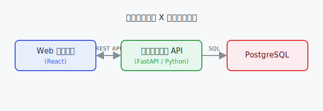

# プロジェクト X — 文書ポータル

プロジェクト X は、社内の受発注管理を刷新するための基幹システム開発プロジェクトです。

```{toctree}
:maxdepth: 2
:caption: 目次

getting-started
api-reference
meeting-notes/2025-06
```

## プロジェクト概要

| 項目 | 内容 |
|---|---|
| プロジェクト名 | プロジェクト X（社内受発注システム刷新） |
| 開始日 | 2025 年 4 月 1 日 |
| リリース予定 | 2026 年 3 月 31 日 |
| PM | 山田 太郎 |
| リードエンジニア | 鈴木 花子 |

## 背景・目的

現行の受発注システムは 2010 年に構築されたレガシーシステムであり、以下の課題を抱えています。

- Excel ベースの台帳管理によるデータ不整合
- 在庫確認のリードタイムが平均 2 営業日
- モバイル非対応

本プロジェクトではこれらを解消し、**リアルタイム在庫確認・モバイル対応・他システム API 連携**を実現します。

## システム構成

```
┌─────────────┐     REST API     ┌─────────────────┐
│  Web フロント │ ◄──────────────► │  バックエンド API  │
│  (React)    │                  │  (FastAPI/Python)│
└─────────────┘                  └────────┬────────┘
                                          │
                                  ┌───────▼────────┐
                                  │   PostgreSQL   │
                                  └────────────────┘
```

## 図・画像の挿入例

### 画像の挿入

`source/images/` に置いた画像は Markdown の標準記法で挿入できます。



### Mermaid 図

`sphinxcontrib-mermaid` 拡張により、コードではなく**図として**レンダリングされます。

```{mermaid}
flowchart LR
    U[利用者] -->|発注| W[Web フロント]
    W -->|REST API| A[バックエンド API]
    A -->|SQL| D[(PostgreSQL)]
    A -->|在庫照会| S[在庫サービス]
```

シーケンス図も書けます。

```{mermaid}
sequenceDiagram
    participant W as Web フロント
    participant A as バックエンド API
    participant D as PostgreSQL
    W->>A: POST /orders（発注）
    A->>D: INSERT orders
    D-->>A: order_id
    A-->>W: 201 Created
```

## マイルストーン

| フェーズ | 期間 | 成果物 |
|---|---|---|
| 要件定義 | 2025/04 〜 2025/05 | 要件定義書・画面仕様書 |
| 設計 | 2025/06 〜 2025/07 | DB 設計書・API 仕様書 |
| 開発 | 2025/08 〜 2025/12 | ソースコード・単体テスト |
| 検証 | 2026/01 〜 2026/02 | 結合テスト・UAT |
| リリース | 2026/03 | 本番環境リリース |

:::{note}
この文書は Sphinx + MyST(Markdown) + Furo テーマで管理しています。
`.rst`（reStructuredText）と `.md`（Markdown）を混在できます。
:::
